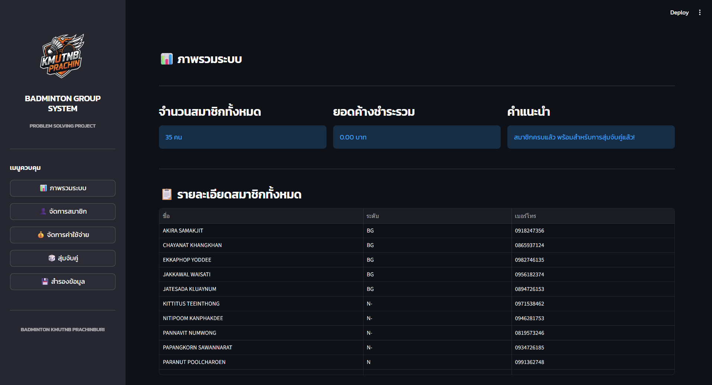
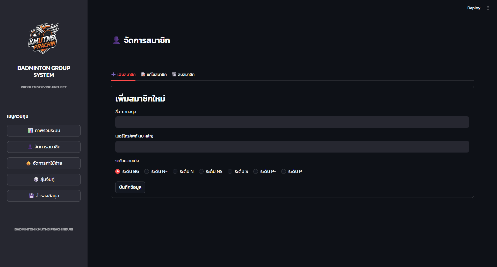
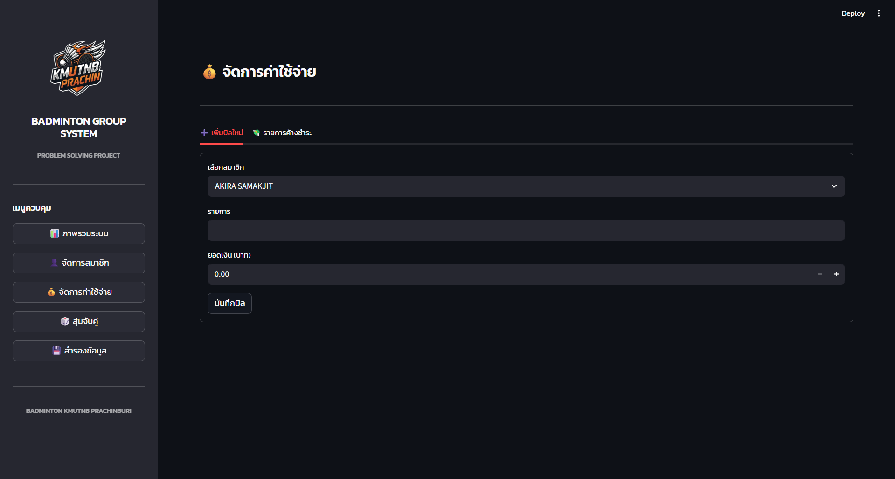
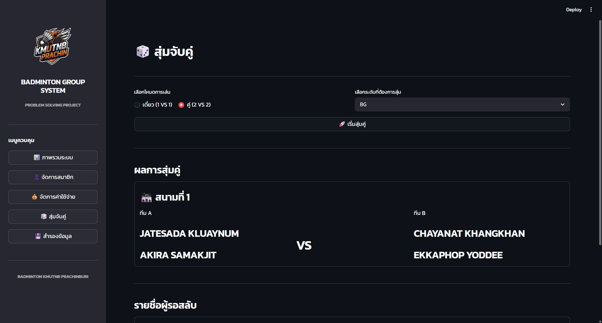
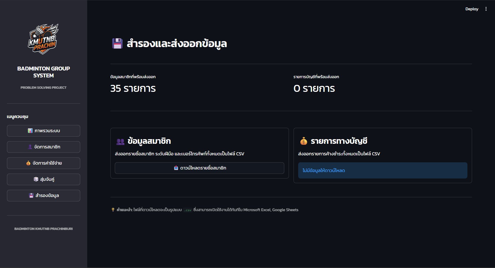

# 🏸 Badminton Group System

---

## 🔍 Overview

ระบบนี้ถูกพัฒนาขึ้นเพื่อแก้ปัญหาการจัดการก๊วนแบดมินตันแบบเดิมที่ใช้การจดบันทึกหรือแอปแชท  
ซึ่งทำให้เกิดปัญหา เช่น ข้อมูลสูญหาย การจัดคู่ไม่สมดุล และการติดตามค่าใช้จ่ายทำได้ยาก  

โดยระบบนี้รวมทุกอย่างไว้ใน Web Application เดียว:
- จัดการสมาชิก
- จัดการค่าใช้จ่าย
- สุ่มจับคู่
- แสดงผลข้อมูลแบบ Dashboard

---

## ✨ Features

### 👤 Member Management
- เพิ่ม / แก้ไข / ลบ สมาชิก
- กำหนดระดับฝีมือ (BG → P)
- ตรวจสอบข้อมูลซ้ำ (ชื่อ / เบอร์โทร)

### 💰 Expense Management
- บันทึกค่าใช้จ่ายรายบุคคล
- แสดงรายการค้างชำระ
- ลบรายการเมื่อชำระแล้ว

### 🎲 Match Making
- รองรับ 1v1 และ 2v2
- เลือกสุ่มตามระดับฝีมือ
- แสดงผู้เล่นที่เหลือ (Waiting List)

### 📊 Dashboard
- จำนวนสมาชิกทั้งหมด
- ยอดค้างชำระรวม
- สถานะระบบ

### 💾 Data Export
- Export ข้อมูลเป็น CSV
- ใช้ต่อใน Excel / Google Sheets ได้

---

## 📸 Screenshots

### Dashboard


### Member Management


### Expenses


### Match Making


### Backup

---

## ⚙️ Installation & Run Programs

```bash
pip install -r requirements.txt
python -m streamlit run app.py
```
👉 ระบบจะเปิดบน Web Browser อัตโนมัติ

---

## 👨‍💻 Authors

- นายปุญญพัฒน์ดนัย มั่นคง 6806022610119  
- นายอคิราภ์ สมัครจิตร์ 6806022610186  
- นายปภังกรณ์ สุวรรณรัตน 6806022610097  

---
